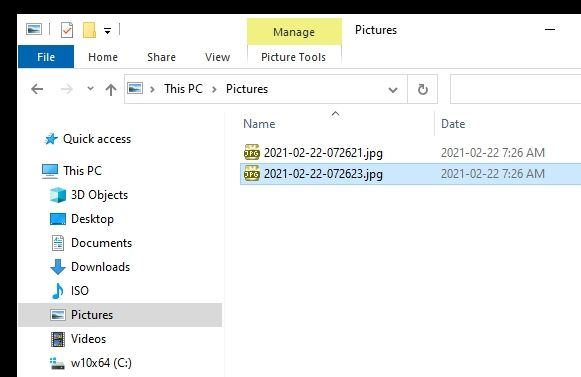
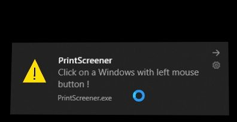
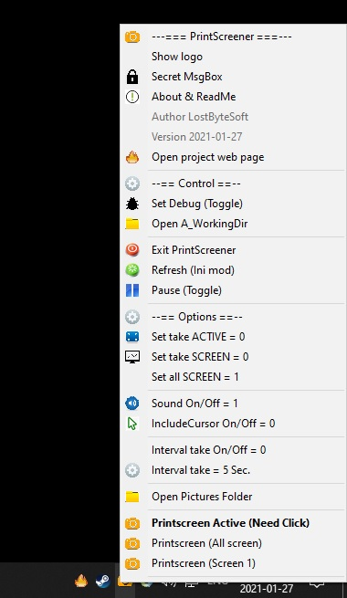

# PrintScreener

Updated: 2021-06-20 to support win 11

Files and Use
--------------------------------------------------------------------

Windows 10 does not make a file if you press "PrintScreen", with this simple software it does now.

Just press "PrintScreen" key : HotKey Printscreen , just take a snapshot of the screen.

You NEED "iview442_x64_setup.exe" found it here http://www.irfanview.com/64bit.htm

Take a snapshot of the screen or active windows or by click.

The picture appear in your Pictures folder. (C:\Users\$USER\Pictures)

You can simply install this software with the file InstallPrtSrc.bat

Options
--------------------------------------------------------------------
You can change all options in file PrintScreener.ini

[options]

;; This file version 2021-01-27

;; must by 0 or 1 , only one can be activated.
;; You must restart the program (or Refresh) to changes take action.

activescreen=0

activewindows=0

allmonitors=1

;; activate sound : 0 or 1

sound=1

;; Interval time between snapshot

interval=5

;; Incude cursor with the printscreen : 0 or 1
;; Also modify : C:\Program Files\IrfanView\i_view64.ini

IncludeCursor=0

Menu Tray
--------------------------------------------------------------------
This is the menu tray ! There are no more menu anywhere.

Licence of use
--------------------------------------------------------------------

            DO WHAT THE FUCK YOU WANT TO PUBLIC LICENSE
   Version 3.14159265358979323846264338327950288419716939937510582
                          March 2017

 Everyone is permitted to copy and distribute verbatim or modified
 copies of this license document, and changing it is allowed as long
 as the name is changed.

            DO WHAT THE FUCK YOU WANT TO PUBLIC LICENSE
   TERMS AND CONDITIONS FOR COPYING, DISTRIBUTION AND MODIFICATION

              You just DO WHAT THE FUCK YOU WANT TO.

		          NO WARRANTY 

	As is customary and in compliance with current global and
	interplanetary regulations, the author of these pages disclaims
	all liability for the consequences of the advice given here,
	in particular in the event of partial or total destruction of
	the material, Loss of rights to the manufacturer's warranty,
	electrocution, drowning, divorce, civil war, the effects of
	radiation due to atomic fission, unexpected tax recalls or
	    encounters with extraterrestrial beings 'elsewhere.

              LostByteSoft no copyright or copyleft.

--------------------------------------------------------------------